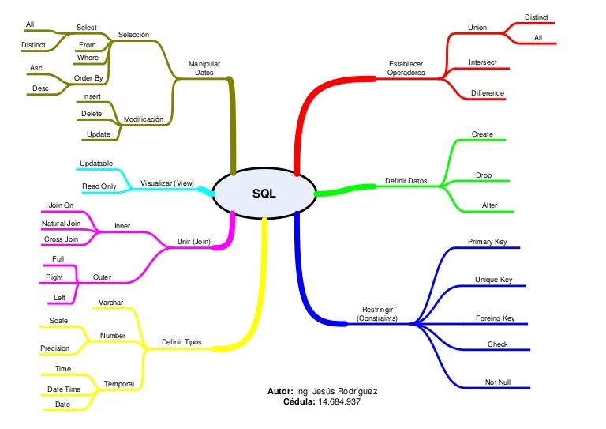

# **Curso de analisis de negocios para ciencias de datos**

- [**Curso de analisis de negocios para ciencias de datos**](#curso-de-analisis-de-negocios-para-ciencias-de-datos)
  - [**Introduccion**](#introduccion)
  - [**¿Qué es ciencia de datos y big data? ¿Cómo afectan a mi negocio?**](#qué-es-ciencia-de-datos-y-big-data-cómo-afectan-a-mi-negocio)
  - [**¿Qué tipo de información podemos analizar?**](#qué-tipo-de-información-podemos-analizar)
    - [**Tipologia de datos**](#tipologia-de-datos)
      - [**Tipo de datos personas**](#tipo-de-datos-personas)
      - [**Tipo de datos transacciones**](#tipo-de-datos-transacciones)
        - [**Transacciones monetarias**](#transacciones-monetarias)
        - [**Transacciones no monetarias**](#transacciones-no-monetarias)
      - [**Tipo de datos web**](#tipo-de-datos-web)
      - [**Tipo de datos machine 2 machine**](#tipo-de-datos-machine-2-machine)
      - [**Tipo de datos biometricos**](#tipo-de-datos-biometricos)
  - [**¿Cómo crear empresas y culturas data-driven?**](#cómo-crear-empresas-y-culturas-data-driven)
  - [**¿Qué es inteligencia artificial y machine learning?**](#qué-es-inteligencia-artificial-y-machine-learning)
  - [**Deep learning**](#deep-learning)
  - [**Flujo de trabajo en ciencias de datos: fases,roles y oportunidades laborales.**](#flujo-de-trabajo-en-ciencias-de-datos-fasesroles-y-oportunidades-laborales)
  - [**Herramientas de software mas especificas para cada rol en el mundo de los datos**](#herramientas-de-software-mas-especificas-para-cada-rol-en-el-mundo-de-los-datos)
    - [Extraccion de informacion con SQL](#extraccion-de-informacion-con-sql)
    - [Herramientas exploratorias y predictivas](#herramientas-exploratorias-y-predictivas)
  - [**El uso de sql en el proceso de analisis de datos**](#el-uso-de-sql-en-el-proceso-de-analisis-de-datos)
  - [**Los conflictos y retos eticos y tratamiento de datos**](#los-conflictos-y-retos-eticos-y-tratamiento-de-datos)
  - [**Aplica técnicas de storytelling para convertir problemas de datos en historias**](#aplica-técnicas-de-storytelling-para-convertir-problemas-de-datos-en-historias)
    - [**Estructura del problema**](#estructura-del-problema)
    - [**Estructura de la hipotesis de forma storytelling**](#estructura-de-la-hipotesis-de-forma-storytelling)
    - [**Analisis cuantativo**](#analisis-cuantativo)
    - [**Analisis cualitativo**](#analisis-cualitativo)
    - [**Fusion cuati-cualitativa**](#fusion-cuati-cualitativa)
    - [**Mineria de texto**](#mineria-de-texto)
      - [**Geolocalizacion**](#geolocalizacion)
    - [**Acciones y algoritmos**](#acciones-y-algoritmos)
      - [**Algoritmos usados en la ciencia de datos**](#algoritmos-usados-en-la-ciencia-de-datos)

## **Introduccion**

Este curso se basa en la exploracion del mundo de los datos.
Tambien en los roles de profesionales de datos y las herramientas, metodologias y procesos que utilizan cada uno.

## **¿Qué es ciencia de datos y big data? ¿Cómo afectan a mi negocio?**

El  *big data* es el termino para referirce a big data, es una cantidad de datos que no es facil de analizar debido a su tamaño.
El big data y la ciencia de datos es la rama que contacta al usuario con el empresario por medio de datos.
La ciencia de datos utiliza la estadistica, la progrmacion y la inteligencia del negocio para generar soluciones.

## **¿Qué tipo de información podemos analizar?**

Los datos pueden tener diferentes caracteristicas que los definen lo suficiente como para clasificarlos dentro de cierta tipologia.

### **Tipologia de datos**

- Personas
- Transacciones
- Nvegacion web
- Machine 2 Machine
- Biometricos

#### **Tipo de datos personas**

Son datos generados por las personas, como lo puede ser preferencias,gustos que permiten generar desgloce de informacion.

#### **Tipo de datos transacciones**

Si hay flujo de dinero se llaman *transacciones monetarias* y si no hay dinero se llaman *transacciones no monetarias*.

##### **Transacciones monetarias**

Un ejemplo de estas transacciones son las que se realizan en las app bancarias, que ademas de generar informacion monetaria tambien pueden generar informacion de la persona y sus gustos y como se relacionan con el dinero. Un ejemplo de esto seria que la app de un banco te recomiende diferentes bares con un rango de precios que esta dentro de tu presupuesto, todo esto por medio de saber en que lugares tiendes a gastar tu dinero.

##### **Transacciones no monetarias**

Son aquellas transacciones no relacionadas con el dinero, un ejemplo serian el intercambio de mensajes o llamadas con tus amigos. En esta transacciones se captura informacion como por ejemplo que tanto mensajeas, que tan largos son tus mensajes, a que tipo de personas le escribes entre otros datos.
Los datos que capturan en este tipo de transacciones le permiten a las empresas a tomar decisiones como lo puede ser enviar mensajes que incentiven el envio de mensajes cuando se dan de cuenta que ha reducido la actividad.

#### **Tipo de datos web**

Son aquellos datos obtenidos por medio de cookies,estos permiten saber las caracteristicas de las personas que acceden a nuestra web, y com se comportan en el tiempo que usan la misma.

#### **Tipo de datos machine 2 machine**

Son aquellos datos que comparten las maquinas, un ejemplo son los datos de geoposicion entre dos dispositivos.

#### **Tipo de datos biometricos**

Son identificadores unicos de los individuos, los mas utilizados son las huellas deigitales, reconocimiento facial.

## **¿Cómo crear empresas y culturas data-driven?**

Se consideran 8 pasos necesarios para crear una cultura data driven y esta adecaurla a una empresa funcional.

- **Creacion de una cultura data driven** : Lo primero es especificar que una cultura data driven se refiere a una cultura donde los datos son el core de la empresa y de la filosofia que rige la toma de decisiones.
- **Recoleccion de informacion** : Recibir toda la informacion que nos llege y nos sea util. Esto requiere procesos de limpieza y recoleccion.
- **Medir todo** : La informacion recolectada debe ser utilizada para medir stast.
- **Datos relevantes y precios** : Vamos a revisar que datos son importantes para nosotros a partir de todo lo recolectado y medido anteriormente. Esta informacion es relevante o no relevante dependiendo de que quiero responder y como funciona nuestra empresa.
- **Testear y crear hipotesis** :Todo parte apartir de una pregunta o la idea de comprobar una idea.
- **Desde los insights de datos a las acciones** : Apartir de los insights tomados de los datos relevantes, obtener informacion que se considere importante y tomar acciones apartir de estos, por ejemplo generar recordatorios de que se acerca el tiempo para realizar el mantenimiento preventivo de tu auto teniendo en cuenta la frecuencia de mantenimiento de un cliente.
- **Cumplir las regulaciones de datos** :No tomar desiciones sesgadas,tener como pilar la etica y el cumplimiento de las leyes que rigen nuestro producto.
- **Automatizar** :Si elproceso anterior se tiene que repetir de forma ciclica cada cierto tiempo sera mejor,generar una automatizacion que nos permita reducir este trabajo y el gasto de tiempo y dinero asociado al mismo.

## **¿Qué es inteligencia artificial y machine learning?**

Es la rama de la informatica que tiene como objetivo replicar la inteligencia de un humano de forma artificial.
Esta inteligencia se basa en entrenar y predecir un resulatdo. Todo este proceso se puede automatizar.
El machine learnig es la evolucion de la inteligencia artificial, no solo se analiza la informacion y se procesa de forma establecida y rigida, si no que tambien puede aprender y por medio de los errores mejorarse de forma conntinua para resolver una tarea. No nos interesa saber como resuelve estos problemas es decir que tiene carta libre para tomar desiciones.
Algunos de los ejemplos de la aplicacion practica de la machine learning:

- **Deteccion de fraudes** :La forma de determinar si algo es un fraude o no se puede determinar por medio del analisis de comportamiento de las transacciones y acciones de un usuario.
La forma de analizar todo estos comportamientos se realizan por medio de machine learning donde toma las acciones de los usuarios y las compara con las acciones de los perfiles que han sido fraudes.
- **Busqueda web** : Apartir de nuestra navegacion e historial de busquedas, los motores de busquedas nos recomiendan cierto contenido que normalmente puede ser web relacionada o una publicidad interesante.
- **Anuncios a tiempo** : Nos ofrece publicidad referente a compras o a busqueda de contenido respecto a lo que estamos viendo en ese justo momento. Por ejemplo si estoy mirando celulares me ofrecen planes de datos ya que si compro un celular lo mas seguro es que necesite internet en el.
- **Analisis de textos** :No solo se miden numeros, si no que se explora informacion categorica, que tiene un contexto que cambia el significado.
- **Next best action** :Te da la opcion o sugerencia de cual seria una buena accion a realizar.

## **Deep learning**

Con el deep learning se puede mejorar software que realiza varias tareas:

- **Clasificacion**: Puede clasificar informacion que puede estar en formato de imagen,sonido,video etc.
Un ejemplo puede ser determinar si el contenido de una imagen es un perro o un gato.
- **Prediccion**: Apartir de datos de entrada y de salida esta inteligencia puede realizar prediciones de salid apartir de una entrada.
Un ejemplo puede ser apartir de una entrada de gustos predecir que canciones le puede gustar.

## **Flujo de trabajo en ciencias de datos: fases,roles y oportunidades laborales.**

Los roles principales basados en datos

- **Ingeniero de datos o data engineer**: Con este perfil se inicia el proceso de datos,construye la informacio a almacenar.
Diseña como se guarda la informacion,como se accede y como se transforma la misma.
Sus tareas principales se resumen pero no se limitan a :
  - *Bases de datos*
  - *Etls/Apis*
  - *SQL y NOsql*
- **Analista business intelligence** : El analista de negocio, apartir de la informacion y las herramientas creadas apartir del ingeniero de datos extrae informacion y genera dashboards con herramientas como lo es:
  - Excel
  - Sql
  - Tableau
  - Power Bi
Ademas de generar estos entregables genera procesos de automatizacion que ayuden a gastar mas tiempo analisando el estado actual y no realizando procesos de programacion.
- **Data scientist** : Es un rol que se encarga de no solo analizar el presente si no el futuro tambien apartir de la data del presente y del pasado.Este rol tiene como base de conocimientos la estadistica,la programacion y la inteligencia de negocio.
  Las herramientas que usa son :
  - Conocimientos matematicos sobre todo estadisticos
  - Programacion sobre todo visualizacion de datos,creacion de modelos,machine learning.
  - Herramientas propias del mundo de la administracion de empresas combinado con el mundo de las empresas y su relacion con el mundo del marketing y la economia.
- **Data traslador** : Es un rol mas enfocado a liderar y mancomunar el esfuerzo del equipo para llegar a resolver de forma satisfacctoria el problema planteado, esta persona puede ser experto en cualquiera de los roles presentados anteriormente o alguien que entienda los datos de forma promedio pero sepa bastante de negocios.
- **Machine engineer**: Es un rol que se especializa en diseñar,crear y utilizar y desplegar en produccion la inteligencia artificial sobre todo el deep learning necesaria para resolver problemas que ya el cientifico de datos a dado una problable solucion.

## **Herramientas de software mas especificas para cada rol en el mundo de los datos**

### Extraccion de informacion con SQL

La usan normalmente los analistas de datos y el ingeniero de datos.

Estos dos roles se basan bastante en la extraccion de informacion, sintesis de informacion y cuadros de informacion normalmente obtenidos de las bases de datos por lo cual utilizan un lenguaje de bases de datos que normalmente es *sql*.

### Herramientas exploratorias y predictivas

Estas herramientas las utilizan normalmente el cientifico de datos.
Normalemente se usan para analisis estadistico y visualizacion de datos y prediccion  como lo es *R studio*,*Python*.

- R analisis economico y enfasis mas investigativo por medio de la estadistica.
  - Packages: ggplot2, dplyr
- Phyton analisis mas ingenieril y predictivo por medio de modelos de machine learning.
  - Modulos Pandas, Numpy, Seaborn,Keras,Tensorflow entre otros.  

## **El uso de sql en el proceso de analisis de datos**

Pasos para resolver una pregunta con sql:

1. Crear una pregunta bien estructurada apartir de los datos y tablas que se encuentran en nuestras bases de datos.
2. Entender la base de datos que tenemos a disposicion y despues plantear como podriamos resolver la pregunta, esto se puede realizar de forma semantica ya que tendremos las instrucciones que podemos pasar a codigo.
3. Realizar la consulta sql que esta basada en la solucion semantica realizada anteriormente. Para hallar la consulta sql correspondiente se debe conocer bien el lenguaje.

## **Los conflictos y retos eticos y tratamiento de datos**

Poder identificar la informacion sensible o confidencial y que hacer y que no hacer con ella, esto dentro de otras preguntas eticas es algo en lo que se debe generar preguntas.

La decicion de compartir o no nuestra informacion personal deberia ser una desicion que solo nosotros deberiamos tomar, sin embargo por medio de algunas plataformas podemos subir informacion personal de otra personal sin el consetimiento de ellos,¿Esto esta bien?,¿Deeberiamos hacerlo?, estas preguntas entran entre la etica y los conflictos que tienen el tratamiento de datos y su recoleccion.

## **Aplica técnicas de storytelling para convertir problemas de datos en historias**

Desagregar un problema en una estructura logica que permite nos permite seguir pasos secuenciales para responder el problema.

### **Estructura del problema**

1. **Problema y la hipotesis**
   1. Tener una situacion,y dar una hipotesis sobre lo que creemos que pasa, apartir de aqui se comienza a trabajar alrededor de esta hipotesis, para comprobar si es falsa o verdadera y que podemos obtener apartir de esto.
   2. Revisar si tenemos que realizar todo un problema que tiene generadores que hay que estudiarlos. o en cambiio es algo muy puntual y solo necesita una solucion puntual y no hay que profundizar mas.
2. **Propuesta de solucion**
   1. Entender las razones que generan el problema
   2. Proponer acciones
3. **Alcance**
   1. Revisar que tanto efecto o alcance nuestra solucion ,determinar si este alcance es mayor o menor al que esperamos ya sea de forma sectorizada o temporal.
   2. Determinar si las acciones se puede aplicar de forma personalizada si es necesario.
   3. Automatizacion de la solucion.

### **Estructura de la hipotesis de forma storytelling**

1. El que:
  Cual es el problema, una descripcion lo suficientemente completa.  
2. El por que:
  Buscar las posibles razones que generan el problema, esta parte se puede sub dividir en muchas tareas o procesos secundarios segun la metodologia y el proceso a seguir.
  Algunas motivaciones que se pueden ver con frecuencia son :
   1. Motivaciones economicas.
   2. Politicas de la empresa
   3. Problemas tecnologicos
   4. Preguntas entre otras.
3. Como :
   Buscar posibles soluciones , este proceso tiene varias fases que dependiendo el problema no hay que seguir todas al pie de la letra:
   1. Analisis cuantitativo
   2. Analisis cualitativo
   3. Matriz cuantitativo-cualitativo
   4. Definir acciones de prevencion
   5. Validacion

### **Analisis cuantativo**

Este analisis se basa en datos numericos y no tanto en cualidades.
Tiene 3 fases principales.

- Obtener de informacion: Normalmente se hace apartir de bases de datos por lo que usamos *sql* .[el como y que debemos tener en cuenta ya se ha explicado anteriormente](#el-uso-de-sql-en-el-proceso-de-analisis-de-datos)
- Identificar: Se busca patrones y las variables significativas y como analizo esto.
- Definir: Establecer acciones segun sea lineamientos o rangos que se pudieron determinar apartir del paso anterior.  

### **Analisis cualitativo**

Identificar variables cualitativas de nuestra investigacion.

- Agrupar : Se puede clasificar por medio de caracteristicas.
- Clasificar : Apartir de la agrupacion, generamos categorias donde podemos clasificar nuestros datos.
- Profundizar : Explorar de forma mas especifica cada clasificacion, un ejemplo es la geolocalizacion.

### **Fusion cuati-cualitativa**

Es la union de la exploracion cuantitativa, y la exploracion cualitativa.

Se puede realizar por medio de una matriz.
La interseccion de los tipos de datos nos dara lo equivalente a un heatmap.

### **Mineria de texto**

Cuando profundizamos en la exploracion de los datos vemos que bastante de la informacion de la cual vamos a poder acceder es texto, el poder analizarla puede llegar a ser un reto bastante grande debido a que el texto incluye contexto y sentido segun este escrito.
Para poder analizar este tipo de datos se usa algo llamado *mineria de texto*.
Se puede realizar con scripts o de forma manual y podemos hacerlo con un objetivo especifico, como por ejemplo el sentimiento que trasmite el texto.

#### **Geolocalizacion**

Parte de la clasificacion y de la profundizacion de nuestros datos, se relacionaran con la geolocalizacion.
Dependien la localizacion de un cliente su comportamiento puede cambiar.

### **Acciones y algoritmos**

Despues de nuestra exploracion profundizacion en los datos, podemos utilizar ciertos algoritmos nos permiten tomar acciones.

#### **Algoritmos usados en la ciencia de datos**

Estos algoritmos se basan en la exploracion y la declaracion de decisiones por medio de herramientas matematicas.

- Mineria de datos para clasificacion de motivos de contacto.
- Corrlaciones y patrones de comportamiento.
- Arboles de decision y teoria de juegos para predecir y tomar decisiones.
- Validacion con bayesianos y MCMC.
